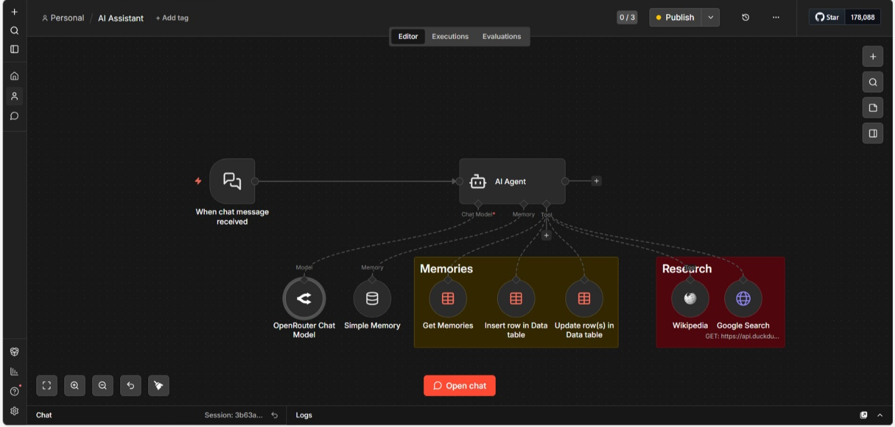

# 🤖 Xavier — Personal AI Assistant
> Built with n8n | Powered by GPT-4.1 | Real-time Web Search | Persistent Memory

---

## 📌 Overview

Xavier is a personal AI assistant built entirely using n8n workflow 
automation — no backend code written from scratch. It can hold 
natural conversations, remember facts about you across sessions, 
and search the web in real time to answer questions beyond its 
training data.

This was built as my first AI automation project to learn agentic 
AI design, tool integration, and workflow architecture using 
modern no-code/low-code tools.

---

## ✨ Features

- 💬 **Conversational Memory** — Remembers the last 20 messages 
  for natural flowing conversation
- 🧠 **Persistent Memory** — Saves, retrieves and updates facts 
  about you across sessions using a structured data table
- 🔍 **Real-time Web Search** — Searches DuckDuckGo for current 
  information and recent events
- 📖 **Deep Knowledge Lookup** — Pulls detailed explanations 
  from Wikipedia for complex topics
- ⚡ **GPT-4.1 Powered** — Uses OpenAI's latest model via 
  OpenRouter for intelligent responses
- 🎯 **Smart Tool Selection** — Agent automatically decides 
  which tool to use based on your question

---

## 🛠️ Tech Stack

| Tool | Purpose |
|------|---------|
| n8n | Workflow automation and agent orchestration |
| OpenRouter API | Access to GPT-4.1 language model |
| DuckDuckGo API | Free real-time web search (no API key needed) |
| Wikipedia API | Deep knowledge and topic explanations |
| n8n Data Tables | Persistent memory storage |

---

## 🏗️ Architecture

**Flow:**

**[Chat Trigger]** → **[AI Agent — Pibbs]**

**AI Agent connects to:**

| Component | Type | Details |
|-----------|------|---------|
| 🤖 GPT-4.1 | Language Model | Via OpenRouter API |
| 💾 Buffer Window | Short-term Memory | Last 20 messages |
| 🔍 DuckDuckGo | Tool | Real-time web search |
| 📖 Wikipedia | Tool | Deep knowledge lookup |
| 🧠 Get Memories | Tool | Retrieve saved facts |
| ➕ Insert Memory | Tool | Save new information |
| ✏️ Update Memory | Tool | Modify existing facts |
---

## 🎬 Demo

### Workflow in Action

### Workflow Canvas

---

## ⚙️ How to Run Locally

### Prerequisites
- n8n installed locally or n8n cloud account
- OpenRouter API key (free tier available at openrouter.ai)

### Steps

1. **Clone this repository**
git clone https://github.com/Sharda2004196/Xavier-AI-Assistant

2. **Import the workflow**
Open your n8n instance
Click "+" → "Import from file"
Select AI_Assistant.json

3. **Set up credentials**
Go to Settings → Credentials
Add your OpenRouter API key

4. **Set up the Data Table**
Create a new Data Table called Memories
Add two columns:
memory_key (string)
memory_value (string)

5. **Activate the workflow**
Toggle the Activate switch in top right
Click the Chat button to start talking!

## ⚠️ Why No Live Demo Link?

I want to be transparent about this — the assistant runs
on my local machine (localhost:5678) which cannot be
accessed publicly without additional infrastructure setup.

Deploying it publicly would require either:
A cloud server (AWS/Railway/VPS) to host n8n 24/7
Or exposing localhost via a tunneling tool like ngrok
(which generates temporary URLs that expire)
Since this is a learning/portfolio project I prioritised
building and documenting the workflow correctly over
infrastructure deployment. A screen recording and
workflow screenshots are provided above as proof of
working functionality.

**Future plan**: Deploy on Railway or n8n Cloud free
tier once I explore cloud deployment as a next step
in my learning journey.

## 📚 What I Learned

Designing agentic AI workflows with multiple tools

Connecting and configuring external APIs without writing code

Implementing persistent memory in an AI system

Understanding how LLM agents decide which tool to call

Workflow debugging and error handling in n8n

## 🚀 Future Improvements
[ ] Add Gmail integration to read and summarise emails

[ ] Connect Google Calendar for scheduling assistance

[ ] Add a Telegram interface for mobile access

[ ] Deploy on n8n Cloud for 24/7 availability

[ ] Add more memory tools (delete memory, list all memories)

## 👤 Author
Sharda Vatsal Bhat
LinkedIn:https://linkedin.com/in/sharda-vatsal-bhat-73b03729
GitHub:https://github.com/Sharda2004196

Built with ❤️ using n8n — my first AI automation project
